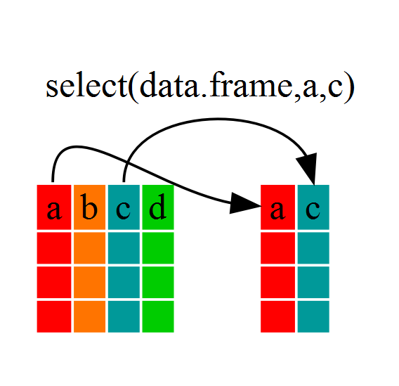
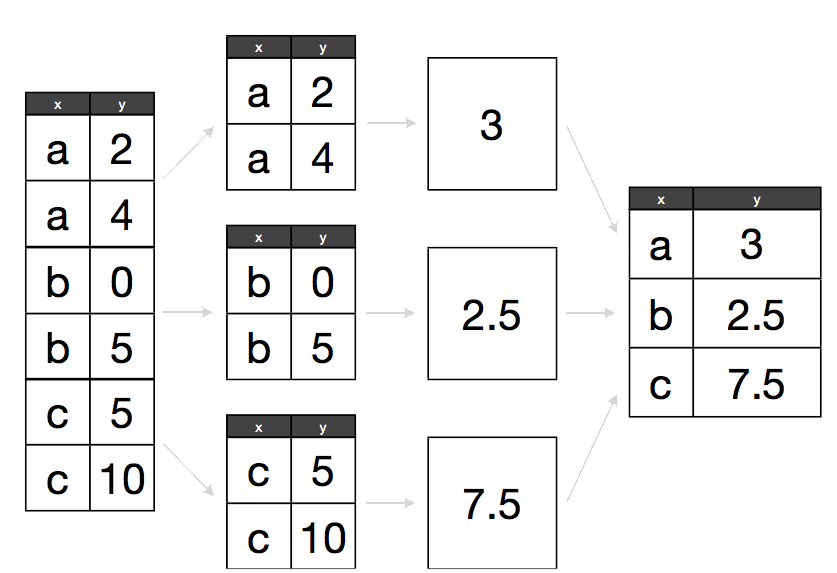

% Data Wrangling and Manipulation
% August 2016, UC Berkeley % updated October 2017
% Rochelle Terman (rterman@gmail.com) % Josh Quan (joshua.quan@berkeley.edu)


```{r chunksetup, include=FALSE} 
# include any code here you don't want to show up in the document,
# e.g. package and dataset loading
library(dplyr)
library(tidyr)
library(ggplot2)
```

# dplyr/tidyr

> It is often said that 80% of data analysis is spent on the process of cleaning and preparing the data. (Dasu and Johnson, 2003)

1. ***Manipulating*** data frames, e.g. filtering, summarizing, and conducting calculations across groups.
2. ***Tidying*** data into the appropriate format
3. Attempting to ***describe relationships*** or conduct ***causal inference*** 

# Dataframe Manipulation/Example Dataset

For this unit, we'll be working with the "Gapminder" dataset, which is excerpt of the data available at Gapminder.org. For each of 142 countries, the data provides values for life expectancy, GDP per capita, and population, every five years, from 1952 to 2007.

```{r}
gapminder <- read.csv("data/gapminder-FiveYearData.csv", stringsAsFactors = TRUE)
head(gapminder)
```

# Dataframe Manipulation/Base R Functions

So far, you’ve seen the basics of manipulating data frames, e.g. subsetting, merging, and basic calculations. For instance, we can use base R functions to calculate summary statistics across groups of observaitons:

```{r}
mean(gapminder[gapminder$continent == "Africa", "gdpPercap"])
mean(gapminder[gapminder$continent == "Americas", "gdpPercap"])
mean(gapminder[gapminder$continent == "Asia", "gdpPercap"])
```

But this isn't ideal because it involves a fair bit of repetition. Repeating yourself will cost you time, both now and later, and potentially introduce some nasty bugs.

# Dataframe Manipulation/dplyr

Luckily, the [`dplyr`](https://cran.r-project.org/web/packages/dplyr/dplyr.pdf) package provides a number of very useful functions for manipulating dataframes. These functions will save you time by reducing repetition. As an added bonus, you might even find the `dplyr` grammar easier to read.

Here we're going to cover 6 of the most commonly used functions as well as using pipes (`%>%`) to combine them.

1. `select()`
2. `filter()`
3. `group_by()`
4. `summarize()`
5. `mutate()`
6. `arrange()`

If you have have not installed this package earlier, please do so now:

```{r,eval=FALSE}
# not run
# install.packages('dplyr')
```

Now let's load the package:

```{r,message=FALSE}
library(dplyr)
```

# Dataframe Manipulation/dplyr/select

Imagine that we just received the gapminder dataset, but are only interested in a few variables in it. We could use the `select()` function to keep only the variables we select.

```{r}
year_country_gdp <- select(gapminder, year, country, gdpPercap)
head(year_country_gdp)
```



If we open up `year_country_gdp`, we'll see that it only contains the year, country and gdpPercap. This is equivalent to the base R subsetting function:

```{r}
year_country_gdp <- gapminder[,c("year", "country", "gdpPercap")]
head(year_country_gdp)
```

But, as we will see, `dplyr` makes for much more readible, efficient code because of its *pipe* operator.

# Dataframe Manipulation/dplyr/pipes

Above, we used what's called 'normal' grammar, but the strengths of `dplyr` lie in combining several functions using *pipes*. Since the pipes grammar is unlike anything we've seen in R before, let's repeat what we've done above using pipes.

```{r}
year_country_gdp <- gapminder %>% select(year,country,gdpPercap)
```

Let's walk through it step by step. First we summon the gapminder dataframe and pass it on, using the pipe symbol `%>%`, to the next step, which is the `select()` function. In this case we don't specify which data object we use in the `select()` function since in gets that from the previous pipe. 

**Fun Fact**: There is a good chance you have encountered pipes before in the shell. In R, a pipe symbol is `%>%` while in the shell it is `|.` But the concept is the same!

# Dataframe Manipulation/dplyr/filter

Now let's say we're only interested in African countries. We can combine `select` and `filter` to select only the observations where `continent` is `Africa`.

```{r}
year_country_gdp_euro <- gapminder %>%
    filter(continent == "Africa") %>%
    select(year,country,gdpPercap)
```

As with last time, first we pass the gapminder dataframe to the `filter()` function, then we pass the filtered version of the gapminder dataframe to the `select()` function.

To clarify, both the `select` and `filter` functions subsets the data frame. The difference is that `select` extracts certain columns, while `filter` extracts certain rows.

 **Note:** The order of operations is very important in this case. If we used 'select' first, filter would not be able to find the variable `continent` since we would have removed it in the previous step.
 
 You can extend filter() with logical conditions:
 
 Logicals

| <  | less than                | !=                     | not equal to      |
|----|--------------------------|------------------------|-------------------|
| >  | greater than             | %in%                   | group membership  |
| == | equal to                 | is.na                  | is NA             |
| <= | less than or equal to    | !is.na                 | is not NA         |
| >= | greater than or equal to | &, |, !, xor, any, all | Boolean Operators |

 
# Challenge 1

Create a new dataframe object called `africa_asia` that is filtered by "Africa" and "Asia". Select all variables except for `gdpPercap`. Use the pipe operator to chain the functions together. 

```{r}

```
 
 

# Dataframe Manipulation/dplyr/Calculations Across Groups

A common task you'll encounter when working with data is running calculations on different groups within the data. For instance, what if we wanted to calculated the mean GDP per capita for each continent?

In base R, you would have to run the `mean()` function for each subset of data:

```{r}
mean(gapminder$gdpPercap[gapminder$continent == "Africa"])
mean(gapminder$gdpPercap[gapminder$continent == "Americas"])
mean(gapminder$gdpPercap[gapminder$continent == "Asia"])
mean(gapminder$gdpPercap[gapminder$continent == "Europe"])
mean(gapminder$gdpPercap[gapminder$continent == "Oceania"])
```

That's a lot of repetition! To make matters worse, what if we wanted to add these values to our original data frame as a new column? We would have to write something like this:

```{r}
gapminder$mean.continent.GDP <- NA

gapminder$mean.continent.GDP[gapminder$continent == "Africa"] <- mean(gapminder$gdpPercap[gapminder$continent == "Africa"])

gapminder$mean.continent.GDP[gapminder$continent == "Americas"] <- mean(gapminder$gdpPercap[gapminder$continent == "Americas"])

gapminder$mean.continent.GDP[gapminder$continent == "Asia"] <- mean(gapminder$gdpPercap[gapminder$continent == "Asia"])

gapminder$mean.continent.GDP[gapminder$continent == "Europe"] <- mean(gapminder$gdpPercap[gapminder$continent == "Europe"])

gapminder$mean.continent.GDP[gapminder$continent == "Oceania"] <- mean(gapminder$gdpPercap[gapminder$continent == "Oceania"])
```

You can see how this can get pretty tedious, especially if we want to calculate more complicated or refined statistics. We could use loops or apply functions, but these can be difficult, slow, or error-prone. 

# Dataframe Manipulation/dplyr/apply-split-combine

The abstract problem we're encountering here is know as "split-apply-combine":




We want to *split* our data into groups (in this case continents), *apply* some calculations on that group, then  *combine* the results together afterwards. 

Module 4 gave some ways to do split-apply-combine type stuff using the `apply` family of functions, but those too are error prone and messy.

Luckily, `dplyr` offers a much cleaner, straight-forward solution to this problem. 

```{r}
# remove this column -- there's a better way!
gapminder$mean.continent.GDP <- NULL
```

# Dataframe Manipulation/dplyr/group_by

We've already seen how `filter()` can help us select observations that meet certain criteria (in the above: `continent == "Europe"`). More helpful, however, is the `group_by()` function, which will essentially use every unique criteria that we could have used in `filter()`.

A `grouped_df` can be thought of as a `list` where each item in the `list` is a `data.frame` which contains only the rows that correspond to the a particular value `continent` (at least in the example above).


# Dataframe Manipulation/dplyr/summarize

The above was a bit uneventful because `group_by()` is much more exciting in conjunction with the `summarize()` function. This will allow use to create new variable(s) by using functions that repeat for each of the continent-specific data frames. In other words, using the `group_by()` function, we split our original dataframe into multiple pieces, which we then use to run functions (e.g. `mean()` or `sd()`) within `summarize()`.

```{r}
gdp_bycontinents <- gapminder %>%
    group_by(continent) %>%
    summarize(mean_gdpPercap = mean(gdpPercap))
head(gdp_bycontinents)
```


That allowed us to calculate the mean gdpPercap for each continent. But it gets even better -- the function `group_by()` allows us to group by multiple variables. Let's group by `year` and `continent`.

```{r}
gdp_bycontinents_byyear <- gapminder %>%
    group_by(continent, year) %>%
    summarize(mean_gdpPercap = mean(gdpPercap))
head(gdp_bycontinents_byyear)
```

That is already quite powerful, but it gets even better! You're not limited to defining 1 new variable in `summarize()`.

```{r}
gdp_pop_bycontinents_byyear <- gapminder %>%
    group_by(continent, year) %>%
    summarize(mean_gdpPercap = mean(gdpPercap),
              sd_gdpPercap = sd(gdpPercap),
              mean_pop = mean(pop),
              sd_pop = sd(pop))
head(gdp_pop_bycontinents_byyear)
```

# Exercise 2

1. Use dplyr to create a data frame containing the median `lifeExp` for each continent


```{r}


```


# Dataframe Manipulation/dplyr/mutate

What if we wanted to add these values to our original data frame instead of creating a new object? For this, we can use the `mutate()` function, which is similar to `summarize()` except it creates new variables to the same dataframe that you pass into it.

```{r}
gapminder_with_extra_vars <- gapminder %>%
    group_by(continent, year) %>%
    mutate(mean_gdpPercap = mean(gdpPercap),
              sd_gdpPercap = sd(gdpPercap),
              mean_pop = mean(pop),
              sd_pop = sd(pop))
head(gapminder_with_extra_vars)
```

We can use also use `mutate()` to create new variables prior to (or even after) summarizing information.

```{r}
gdp_pop_bycontinents_byyear <- gapminder %>%
    mutate(gdp_billion = gdpPercap*pop/10^9) %>%
    group_by(continent, year) %>%
    summarize(mean_gdpPercap = mean(gdpPercap),
              sd_gdpPercap = sd(gdpPercap),
              mean_pop = mean(pop),
              sd_pop = sd(pop),
              mean_gdp_billion = mean(gdp_billion),
              sd_gdp_billion = sd(gdp_billion))
head(gdp_pop_bycontinents_byyear)
```

# Dataframe Manipulation/dplyr/arrange

As a last step, let's say we want to sort the rows in our data frame according to values in a certain column. We can use the `arrange()` function to do this. For instance, let's organize our rows by `year` (recent first), and then by `continent`. 

```{r}
gapminder_with_extra_vars <- gapminder %>%
    group_by(continent, year) %>%
    mutate(mean_gdpPercap = mean(gdpPercap),
              sd_gdpPercap = sd(gdpPercap),
              mean_pop = mean(pop),
              sd_pop = sd(pop)) %>%
    arrange(desc(year), continent)
head(gapminder_with_extra_vars)
```

### Challenge 3

1. Add a column to the gapminder dataset that contains the total population of the continent of each observation in a given year. For example, if the first observation is Afghanistan in 1952, the new column would contain the population of Asia in 1952. 

2. Use dplyr to: (a) add a column called `gdpPercap_diff` that contains the difference between the observation's `gdpPercap` and the mean `gdpPercap` of the continent in that year, (b) arrange the dataframe by the column you just created, in descending order (so that the relatively richest country/years are listed first)


# Tidying Data

Even before we conduct analysis or calculations, we need to put our data into the correct format. The goal here is to rearrange a messy dataset into one that is **tidy**

The two most important properties of tidy data are:

1) Each column is a variable.
2) Each row is an observation.

Tidy data is easier to work with, because you have a consistent way of referring to variables (as column names) and observations (as row indices). It then becomes easy to manipulate, visualize, and model.

For more on the concept of *tidy* data, read Hadley Wickham's paper [here](http://vita.had.co.nz/papers/tidy-data.html)

# Tidying Data/Wide vs. Long Formats

> "Tidy datasets are all alike but every messy dataset is messy in its own way." – Hadley Wickham

Tabular datasets can be arranged in many ways. For instance, consider the data below. Each data set displays information on heart rate observed in individuals across 3 different time periods. But the data are organized differently in each table.

```{r}
wide <- data.frame(
  name = c("Wilbur", "Petunia", "Gregory"),
  time1 = c(67, 80, 64),
  time2 = c(56, 90, 50),
  time3 = c(70, 67, 101)
)
wide

long <- data.frame(
  name = c("Wilbur", "Petunia", "Gregory", "Wilbur", "Petunia", "Gregory", "Wilbur", "Petunia", "Gregory"),
  time = c(1, 1, 1, 2, 2, 2, 3, 3, 3),
  heartrate = c(67, 80, 64, 56, 90, 50, 70, 67, 10)
)
long
```

**Question**: Which one of these do you think is the *tidy* format?

**Answer**: The first dataframe (the "wide" one) would not be considered *tidy* because values (i.e., heartrate) are spread across multiple columns.

We often refer to these different structurs as "long" vs. "wide" formats. In the "long" format, you usually have 1 column for the observed variable and the other columns are ID variables. 

For the "wide" format each row is often a site/subject/patient and you have multiple observation variables containing the same type of data. These can be either repeated observations over time, or observation of multiple variables (or a mix of both). In the above case, we had the same kind of data (heart rate) entered across 3 different columns, corresponding to three different time periods.


You may find data input may be simpler or some other applications may prefer the "wide" format. However, many of R’s functions have been designed assuming you have "long" format data. 

# Tidying Data/Gapminder

Lets look at the structure of our original gapminder dataframe:

```{r}
head(gapminder)
```

**Question**: Is this data frame **wide** or **long**?

**Answer**: This data frame is somewhere in between the purely 'long' and 'wide' formats. We have 3 "ID variables" (`continent`, `country`, `year`) and 3 "Observation variables" (`pop`, `lifeExp`, `gdpPercap`). 

Despite not having ALL observations in 1 column, this intermediate format makes sense given that all 3 observation variables have different units. As we have seen, many of the functions in R are often vector based, and you usually do not want to do mathematical operations on values with different units.

On the other hand, there are some instances in which a purely long or wide format is ideal (e.g. plotting). Likewise, sometimes you'll get data on your desk that is poorly organized, and you'll need to **reshape** it.

# Tidying Data/tidyr

Thankfully, the `tidyr` package will help you efficiently transform your data regardless of original format.

```{r}
# Install the "tidyr" package (only necessary one time)
# install.packages("tidyr") # Not Run

# Load the "tidyr" package (necessary every new R session)
library(tidyr)
```

# Tidying Data/tidyr/gather

Until now, we’ve been using the nicely formatted original gapminder dataset. This dataset is not quite wide and not quite long -- it's something in the middle, but 'real' data (i.e. our own research data) will never be so well organized. Here let's start with the wide format version of the gapminder dataset.

```{r}
gap_wide <- read.csv("data/gapminder_wide.csv", stringsAsFactors = FALSE)
head(gap_wide)
```

The first step towards getting our nice intermediate data format is to first convert from the wide to the long format. 
The function `gather()` will 'gather' the observation variables into a single variable. This is sometimes called "melting" your data, because it melts the table from wide to long. Those data will be melted into two variables: one for the variable names, and the other for the variable values. 

```{r}
gap_long <- gap_wide %>%
    gather(obstype_year, obs_values, 3:38)
head(gap_long)
```

Notice that we put 3 arguments into the `gather()` function: 

1. the name of the new column for the new ID variable (`obstype_year`), 
2. the name for the new amalgamated observation variable (`obs_value`), 
3. the indices of the old observation variables (`3:38`, signalling columns 3 through 38) that we want to gather into one variable. Notice that we don't want to melt down columns 1 and 2, as these are considered "ID" variables.

# Tidying Data/tidyr/select

We can also select observation variables using:

* variable indices
* variable names (without quotes)
* `x:z` to select all variables between x and z
* `-y` to *exclude* y
* `starts_with(x, ignore.case = TRUE)`: all names that starts with `x`
* `ends_with(x, ignore.case = TRUE)`: all names that ends with `x`
* `contains(x, ignore.case = TRUE)`: all names that contain `x`

See the `select()` function in `dplyr` for more options.

For instance, here we do the same thing with (1) the `starts_with` function, and (2) the `-` operator:

```{r}
# with the starts_with() function
gap_long <- gap_wide %>%
    gather(obstype_year, obs_values, starts_with('pop'),
           starts_with('lifeExp'), starts_with('gdpPercap'))
head(gap_long)

# with the - operator
gap_long <- gap_wide %>% 
  gather(obstype_year, obs_values, -continent, -country)
head(gap_long)
```

However you choose to do it, notice that the output collapses all of the measure variables into two columns: one containing new ID variable, the other containing the observation value for that row. 

# Tidying Data/tidyr/separate

You'll notice that in our long dataset, `obstype_year` actually contains 2 pieces of information, the observation type (`pop`, `lifeExp`, or `gdpPercap`) and the `year`.

We can use the `separate()` function to split the character strings into multiple variables:

```{r}
gap_long_sep <- gap_long %>% 
  separate(obstype_year, into = c('obs_type','year'), sep = "_") %>% 
  mutate(year = as.integer(year))
head(gap_long_sep)
```

# Tidying Data/tidyr/spread

The opposite of `gather()` is `spread()`. It spreads our observation variables back out to make a wider table. We can use this function to spread our `gap_long()` to the original "medium" format.

```{r}
gap_medium <- gap_long_sep %>% 
  spread(obs_type, obs_values)
head(gap_medium)
```

All we need is some quick fixes to make this dataset identical to the original `gapminder` dataset:

```{r}
gapminder <- read.csv("data/gapminder-FiveYearData.csv")
head(gap_medium)
head(gapminder)

# rearrange columns
gap_medium <- gap_medium[,names(gapminder)]
head(gap_medium)

# arrange by country, continent, and year
gap_medium <- gap_medium %>% 
  arrange(country,continent,year)
head(gap_medium)
```

# Extra Resources

`dplyr` and `tidyr` have many more functions to help you wrangle and manipulate your data. See the  [Data Wrangling Cheat Sheet](https://www.rstudio.com/wp-content/uploads/2015/02/data-wrangling-cheatsheet.pdf) for more.


### Challenges: tidyr

1. Subset the results from challenge #3 (above) to select only the `country`, `year`, and `gdpPercap_diff` columns. Use `tidyr` put it in wide format so that countries are rows and years are columns. 

2. Now turn the dataframe above back into the long format with three columns: `country`, `year`, and `gdpPercap_diff`.

