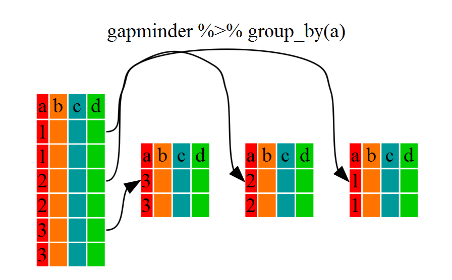

```{r chunksetup, include=FALSE} 
# include any code here you don't want to show up in the document,
# e.g. package and dataset loading
library(here)
library(tidyverse)
library(tibble)
```

## Welcome 

Welcome to Data Wrangling and Manipulation in R. To start with, make sure that you have opened the code in an R project. R projects provide a straightforward way to get all of our code in its own working directory.  

## What is data wrangling 

> It is often said that 80% of data analysis is spent on the process of cleaning and preparing the data (Dasu and Johnson 2003).

At its heart, data wrangling is the set of techniques to get data into a usable form for analysis and visualization. 

The purpose this workshop is to introduce you to a common framework for thinking about data wrangling, show you how to accomplish these tasks within R, and build a base of knowledge for moving onto applied tasks. 

Data wrangling is a catchall for data importing, data cleaning, and data transformation for the goal of creating some product with the finished data. 


## Tidy data 

All messy data is unhappy in its own ways. To put some structure on data, we prefer that our data is *tidy*. In tidy data, every column is a variable, every row is an observation, and every cell is a single value (Wickham 2014). For completeness, these principles are more generally known as [Codd's 3rd Normal Form](https://en.wikipedia.org/wiki/Third_normal_form)

We teach tidy data principles both because they provide a *grammar* with which to think about data wrangling that covers the majority of use cases for analysis, and because a suite of R packages known as the *tidyverse* derives their utility from this framework. 

Tidy datasets provide a standardized way to link the physical appearance of the dataset with its meaning (Wickham 2014). Datasets are made of **rows** and **columns** that contain a collection of **values** 

Values are usually numbers or strings (character vectors in R nomenclature). Each value belongs to a variable and an observation. **Variables** contain a set of values that all measure the same underlying attribute, while observation contain all values measured for a unit. 


## Challenge 1 

Here is a dataset inspired by an Economist/YouGov Poll about the importance of unemployment in the United States. 

```{r}
challenge_1 <- tibble(
  issue_importance = c("Very Important", "Somewhat Important",
                       "Not very Important", "Unimportant"),
  `18-29` = c(.59, .28, .08, .05),
  `30-44` = c(.66, .27, .06, .02),
  `45-64` = c(.69, .28, .03, .01),
  `65+` = c(.7, .27, .02, .01)
)

head(challenge_1)
```

Answer the following: 

1. How many observations are in the data set?

2. How many columns are in the data set?

3. Is every column a variable?

# Wide vs. Long Formats

Tabular datasets can be arranged in many ways. For instance, consider the data below. Both data sets display information on heart rate observed in individuals across 3 different time periods. But the data are organized differently in each table.

## Challenge 2

Which one of these do you think is the *tidy* format?

```{r}
wide <- data.frame(
  name = c("Wilbur", "Petunia", "Gregory"),
  time1 = c(67, 80, 64),
  time2 = c(56, 90, 50),
  time3 = c(70, 67, 101)
)
wide

long <- data.frame(
  name = c("Wilbur", "Petunia", "Gregory", "Wilbur", "Petunia", "Gregory", "Wilbur", "Petunia", "Gregory"),
  time = c(1, 1, 1, 2, 2, 2, 3, 3, 3),
  heartrate = c(67, 80, 64, 56, 90, 50, 70, 67, 10)
)
long
```

**Answer**: The first dataframe (the "wide" one) would not be considered *tidy* because values for a given variable (i.e. heartrate) are spread across multiple columns.

We often refer to these two opposite structures as "long" vs. "wide" formats. In the "long" format, you usually have 1 column for the observed variable(s) and the other columns are ID variables. 

For the "wide" format each row is often a site/subject/patient and you have multiple observation variables containing the same type of data. These can be either repeated observations over time, or observation of multiple variables (or a mix of both). In the above case, we had the same kind of data (heart rate) entered across 3 different columns, corresponding to three different time periods.

## Tidy data 

We saw in challenge 1 that our dataset actually had three variables: interest importance, age, and percent agreement. One aspect of data wrangling is turning messy data into tidy data. 

```{r, echo = F}
challenge_1 %>% 
  pivot_longer(-issue_importance, names_to = "age", values_to = "percent_agreement")%>%
  head()

```

The format here is now tidy. Each column represents a single variable. The separate age columns have been combined into a single column. Each row represents a single cross sectional observation. Finally, each cell represents a single value. 

There's some code here that might be brand new to you. We will cover everything in this code block, but to get familiar with the structure note that we needed to make a dataset that was "wide" (many columns) into a dataset that was "long" (many rows). We did this by "pivoting" the non-variable columns into a two-column key-value pair. While sometimes we may have more than two columns, the general pattern is common and language agnostic. 

## The Tidyverse 

The tidyverse is a core set of packages that most R programmers use on a daily basis for everyday data science tasks. We can load this set of packages all at once with: 

```{r}
library(tidyverse)
```

As you see, tidyverse loads a set of packages including `dplyr` and `tidyy`.  For data wrangling, the primary tidyverse packages of note are `dplyr` and `tidyr`. You can learn more about the tidyverse package [here](https://tidyverse.tidyverse.org/)


Alternatively, we can load individual packages from the tidyverse separately. We do this if we only have need for one of the packages. For example, we can load the `dplyr` package. 

```{r}
library(dplyr)
```

Frankly, unless you are sharing a finished code project or have extreme memory limitations to worry about there is never a problem just loading the tidyverse package.

Importantly, all of these packages are designed around a common philosophy and with a common API design. This means that the packages work well with each other and share a common syntax. While this is an opiniated structure, tidyverse functions turn out to be very flexible. Packages have been developed for a whole host of different tasks to be done in a tidy way, which you can see if you take the next workshop in this sequence. 

Tidyverse functions and packages can also work on different data representations like those from data.table. We like teaching the tidyverse because the grammar of data wrangling is often the same as the name of the function. That is useful for learning, but also for googling. If you know a problem is like a certain type of function in the tidyverse, that provides a good starting point for searching. 

Note that we can do everything that we do in the tidyverse with Base R. So far, you’ve seen the basics of manipulating data frames, e.g. subsetting, merging, and basic calculations. However, the base R version is often cumbersome, and frequently slower computationally. For all of these reasons, the rest of this workshop and its follow on will stick within the tidyverse whenever possible. 


## The Grammar of Data Wrangling

Let's consider what we want to do to go from an initial dataset into a final analysis. We are almost certainly going to want to pick observations based on their values. We might want to display the observations in a way that requires reordering the rows. For some analyses, we will not need all of our variables so will want to pick a subset of them. It may be the case that we need to create a new variable entirely which is a function of variables we have. We may also want one or more summary functions, such as the mean or standard deviation, of each of our variables. Depending on your analysis, you may want to consider changing a variable, filtering a variable, mutating a variable, or summarizing a variable based on individual groups in a data. For example, if you have a data set made up of people who live in different countries, you might want to do all these steps *within* countries. 

The dplyr package provides a number of very useful functions for manipulating dataframes. These functions will save you time by reducing repetition. As an added bonus, you might even find the `dplyr` grammar easier to read.

In this workshop we are going to cover 6 of the most commonly used functions as well as using pipes (`%>%`) to combine them.

1. `filter()`: pick out observations based on their values
2. `select()`: pick certain columns by name
3. `group_by()`: group observations based on a variable
4. `arrange()`: reorder observations based on a variable
5. `summarize()`: summarize observations based on some function 
6. `mutate()`: create new variables with function of existing variables

Each of these verbs works in a similar way. The first argument is always a data frame object. The additional arguments describe what to do with the data frame using unquoted variable names. The end result is a new data frame. 

## An Example Workflow 

Before diving in to each individual function, let's give an example of a data wrangling workflow that starts from reading in a dataset, and then makes a dataset suitable for a descriptive analysis. This example contains an example of every verb we will talk about in this workshop.  

Suppose we have a dataset of individuals' occupations from different US States. In the data folder for this workshop repository, there is a dataset called "jobs" that matches this description. We can read it in with `read_csv` which is available from the tidyverse. `read_csv` works exactly like `read.csv`, but is much quicker. There are other ways to read in very large files (many GB) that can be even faster, but we will not cover them in this workshop. 

*If there's a question. `fread()` from data.table is the best way to read in a big file. Every dplyr command we talk about today works with data.tables.*

The `here` function is a way to create file paths relative to the top level directory. 

For a descriptive analysis, we'd like to know what the average life expectancy is for individuals that are and are not in agriculture for states within each state on the West Coast. In order to accomplish this task, we will need to filter our list of states, group by each state, create a variable denoting whether the individual works in agriculture or not, and summarize the average age of individuals who do and do not work in agriculture. Finally, we'd like to arrange the states in reverse alphabetical order. 

What follows is an example of the workflow just described
```{r}
## Data import 
jobs <- read_csv(here("data/jobs.csv"))

## Workflow 
jobs %>% 
  select(State, Occuptation, Age)%>%
  filter(State %in% c("Alaska","California", "Oregon", "Washington"))%>%
  mutate(in_ag = if_else(Occupation == "Farmer", "Yes", "No"))%>%
  group_by(State, in_ag)%>%
  summarise(average_lifeExp = mean(Age))%>%
  arrange(desc(State))

## We can also save the output of our workflow to a new data frame object
wc_lifeExp <- jobs %>% 
  select(State, Occuptation, Age)%>%
  filter(State %in% c("Alaska","California", "Oregon", "Washington"))%>%
  mutate(in_ag = if_else(Occupation == "Farmer", "Yes", "No"))%>%
  group_by(State, in_ag)%>%
  summarise(average_lifeExp = mean(Age))%>%
  arrange(desc(State))
```

The way to think of the pipe, the symbol at the end of each of these lines that is %>%, is that it takes what is on the left side and makes it the first argument of the right side. In English, "Take the jobs data frame, select the state, occupation, and age columns, filter down to just the observation where the states are Alaska, California, Oregon, and Washington, make a new variable for whether a person is or is not a farmer, within each unique state/agriculture pairing, get the mean age, and present the observation in reverse alphabetical order. Save the result to an object called wc_lifExp" 

The tidyverse is built around pipes because the first argument of every function in the tidyverse is a data frame, which means that the tidyverse all follows the same structure (or API). When doing data tasks, that turns out to be very useful because it is easy to reason about what a function will do, and what it needs. 

## Pipes 

A pipe operator `%>%` or `|>` is a method of chaining together functions. A pipe takes what is on the left hand side of the pipe and makes it the first argument of the function on the right hand side by default. 

```{r, eval = F}
## Pseudo code 
x %>% f(y) 

## is equivalent to 
f(x, y)

## where f() is a function 

## Example with the jobs data set 
jobs %>% 
  filter(State == "California")

## is equivalent to 
select(jobs, State == "California")
```


As mentioned, the advantage of the tidyverse is that every function presumes that the first argument is a tidy data object. It is possible to put the left hand side result as a different argument for the function on the right hand side by explicitly specifying it, however, a well written workflow tends to obviate the need to do so. 

## London Animal Rescue Dataset 

To show the benefits of the `dplyr` verbs, we will start by working with a dataset of animal rescue incidents by the London Fire Brigade from 2009-2021. The data provides information on all incidents along with information on the location, date and time, number of fire trucks, and cost of the rescue. 

```{r}
animals <- read_csv(here("data/animalRescue.csv"))
glimpse(animals)
```


## filter()

Suppose we are interested in looking at animal rescues from 2018-2020. `filter()` allows us to subset observations based on their value. 

Since we are introducing a verb explicitly for the first time, we will show the verb with and without pipes. The API is the same for every verb. 

```{r}
## Get all observations from the Year 2015 
filter(animals, Year == 2015)

## Get all observations from 2018-2020 
filter(animals, Year >= 2018 & Year <=2020)

```

The first argument is the name of the data frame we want to use, in this case "animals". The arguments after are the expressions that filter the data frame. 

Here is the same code with a pipe and a neat shortcut 

```{r}
animals %>% 
  filter(Year == 2015)

animals %>% 
  filter(Year >= 2018 & Year <= 2020)

## which is the same as 
animals %>% 
  filter(between(Year, 2018, 2020))
```

As with the examples we have seen before, we take the animals data frame and then pass it via the pipe to the filter argument. Because the pipe puts the data frame as the first argument for every tidyverse function, we only have to specify the subsequent arguments. `between()` is a `dplyr` function that is a shortcut for x >= left & x <= right where x is our variable of interest. 

 
 You can extend filter() with logical conditions:
 
| Symbol                 | Meaning                  |
|------------------------|--------------------------|
| <                      | less than                |
| >                      | greater than             |
| ==                     | equal to                 |
| <=                     | less than or equal to    |
| >=                     | greater than or equal to |
| !=                     | not equal to             |
| %in%                   | group membership         |
|is.na                   | is NA                    |
| !is.na                 | is not NA                |
|&, \|, !, xor, any, all | Boolean operators        |
 
# Exercise 1

Create a new data frame object called `cats_and_dogs` that is the result of filtering the `animals` data frame for all observations for which the animal type is a cat or a dog. Use the pipe operator the chain the functions together. 

*<small>hint: use both the |, & boolean operator </small>

```{r, include=F}
#YOUR CODE HERE
cats_and_dogs <- animals %>% 
  filter(Type == "Cat"|Type == "Dog")
```

## Multiple Filters at once 

Sometimes we want to filter multiple conditions at once. For example, we might be interested in all rescues of birds or horses after 2011. To accomplish this, we use the `,` in our filter expression. 

```{r}
birds_and_horses <- animals %>% 
  filter(Type == "Bird"|Type == "Horse", Year > 2011)
glimpse(birds_and_horses)
```

We can put multiple `filter` functions in a row in a piped workflow, though it does not look as readable 

```{r}
birds_and_horses2 <- animals %>% 
  filter(Type == "Bird"|Type == "Horse")%>%
  filter(Year > 2011)

## These two data frames are the same 
all.equal(birds_and_horses, birds_and_horses2)
```

## select()

Now we have a data frame of just rescues of cats and dogs. Suppose we are only interested in a few variables of the data frame. We can use the `select()` function to keep only the variables we select. 


To be concrete, suppose we just want to see the Year, Type, and PropertyCategory variables

```{r}
cats_and_dogs_short <- cats_and_dogs %>% 
  select(Year, Type, PropertyCategory)
```

If we open up `cats_and_dogs_short`, we'll see that it only contains the Year, Type, and PropertyCategory columns. 


To clarify, both the `select` and `filter` functions subset the data frame. The difference is that `select` extracts certain columns, while `filter` extracts certain rows. When using `select` and `filter` together, the order of operations are very important. If we used `select` first, the `filter` function can only filter on variables that we selected. 

## Split-Apply-Combine

A common task you'll encounter when working with data is running calculations on different groups within the data. For instance, what if we wanted to calculated the total number of cat rescues for each borough?

The abstract problem we're encountering here is know as "split-apply-combine":


We want to *split* our data into groups (in this case boroughs), *apply* some calculations on that group (in this case count), and then *combine* the results together afterwards. This pattern is both common in data wrangling and a cornerstone of the dplyr approach. 

## group_by()

A `grouped_df` can be thought of as a `list` where each item in the `list` is a `data.frame` which contains only the rows that correspond to the a particular value `continent` (at least in the example above).


Let's demonstrate the benefits of `group_by` by answering the question, "What are total number of cat rescues for each borough?" To do this, we need to count the total number rows that contain the Type "Cat" for each Borough. 

```{r}
borough_cat_rescues <- animals %>% 
  ## group all observations by Boroughs
  group_by(Borough)%>%
  ## get just the observations of cat rescues 
  filter(Type == "Cat")%>%
  ## new function! count the unique values of one or more variables
  count(Type)

head(borough_cat_rescues)
```

To ungroup our dataset, we pass `ungroup()` to our data. 

```{r}
animals %>% 
  group_by(Borough)%>%
  filter(Type == "Cat")%>%
  count(Type)%>%
  ungroup()
```

## arrange()

We now have cat rescues by boroughs, but our quick glimpse has them in a strange order. In order to get the observations from smallest to largest, we can use `arrange()` and pass the variable name of interest. 

```{r}
borough_cat_rescues %>%
  arrange(n)

```

If we want to reverse the order, we need to wrap the variable name in `desc()` like so 

```{r}
borough_cat_rescues %>%
  arrange(desc(n))

```

## Exercise 2

Let's put the verbs we've learned so far into action all at once. Answer the question "What are the total number of dog rescues for each borough?" by making a data frame called `borough_dog_rescues` and arrange the rows by borough in alphabetical order. 

```{r}
## Your Code here 
borough_dog_rescues <- animals %>% 
  group_by(Borough)%>%
  filter(Type == "Dog")%>%
  count(Type)%>%
  arrange(Borough)

```

## summarize()

summarise collapses a data frame to a single row. 

```{r}
animals %>% 
  summarise(avg_rescue_cost = mean(RescueCost, na.rm = T))

## Note that summarise can also be written with a z 
animals %>% 
  summarize(avg_rescue_cost = mean(RescueCost, na.rm = T))
```


`summarise()` becomes extremely useful when paired with group_by
`group_by()`. We just saw that our last block gave the average cost across our data set. By using the `group_by()` function, we split our original data frame into multiple pieces, which we then use to run functions (e.g. `mean()` or `sd()`) within `summarize()`. 


Suppose instead we are interested in the average cost of a resuce for each borough. 

```{r}
animals %>% 
  group_by(Borough)%>%
  summarise(avg_rescue_cost = mean(RescueCost, na.rm=T))%>%
  arrange(desc(avg_rescue_cost))
```

We have now answered the question "What's the average cost by borough across the total dataset?" However, we are not limited to grouping by just one variable. We can group by multiple variables. Let's answer the question "What's the average cost by borough year?" 

```{r}
animals %>% 
  group_by(Borough, Year)%>%
  summarise(avg_rescue_cost = mean(RescueCost, na.rm=T))%>%
  arrange(Borough)

```

That is already quite powerful, but it gets even better! We are not limited to defining 1 new variable in `summarize()`. Suppose we want to know the average deviation within each borough year. 

```{r}
animals %>% 
  group_by(Borough, Year)%>%
  summarise(avg_rescue_cost = mean(RescueCost, na.rm=T),
            sd_rescue_cost = sd(RescueCost, na.rm = T))%>%
  arrange(Borough)
```

You will receive a message that says "`summarise()` has grouped output by 'Borough'. You can override using the `.groups` argument." This is an experimental feature in `dplyr` and does not change the results of our computation at all. The computation that is identical but leads to R not sending that message is the following

*Note, if someone asks you can set the option "dplyr.summarise.inform" to FALSE to remove this message globally*

```{r}
animals %>% 
  group_by(Borough, Year)%>%
  summarise(avg_rescue_cost = mean(RescueCost, na.rm=T),
            sd_rescue_cost = sd(RescueCost, na.rm = T),
            .groups = "drop_last")%>%
  arrange(Borough)

```

## Exercise 3

Create a data frame that considers the average rescue cost, median rescue cost, and standard deviation for bird rescues for each property category year. Save the result of your workflow into a data frame object called `bird_stats`


```{r, include=F}
#YOUR CODE HERE
bird_stats <- animals %>% 
  group_by(PropertyCategory, Year)%>%
  filter(Type == "Bird")%>%
  summarise(median_cost = median(RescueCost, na.rm = T),
            avg_cost = mean(RescueCost, na.rm = T), 
            sd_cost = mean(RescueCost, na.rm = T),
            .groups = "drop_last")

```

## mutate()

What if we wanted to add these values to our original data frame instead of creating a new object? For this, we can use the `mutate()` function, which is similar to `summarize()` except it creates new variables to the same dataframe that you pass into it.

```{r}
gapminder_with_extra_vars <- gapminder %>%
    group_by(continent, year) %>%
    mutate(mean_gdpPercap = mean(gdpPercap),
              sd_gdpPercap = sd(gdpPercap),
              mean_pop = mean(pop),
              sd_pop = sd(pop))
head(gapminder_with_extra_vars)
```

We can use also use `mutate()` to create new variables prior to (or even after) summarizing information.

```{r}
gdp_pop_bycontinents_byyear <- gapminder %>%
    mutate(gdp_billion = gdpPercap*pop/10^9) %>%
    group_by(continent, year) %>%
    summarize(mean_gdpPercap = mean(gdpPercap),
              sd_gdpPercap = sd(gdpPercap),
              mean_pop = mean(pop),
              sd_pop = sd(pop),
              mean_gdp_billion = mean(gdp_billion),
              sd_gdp_billion = sd(gdp_billion))
head(gdp_pop_bycontinents_byyear)
```

# Exercise 3

Add a column to the gapminder dataset that contains the total population of the continent of each observation in a given year. For example, if the first observation is Afghanistan in 1952, the new column would contain the population of Asia in 1952. 

```{r, include=F}
#YOUR CODE HERE
```

# Exercise 4

Use dplyr to: (a) add a column called `gdpPercap_diff` that contains the difference between the observation's `gdpPercap` and the mean `gdpPercap` of the continent in that year, (b) arrange the dataframe by the column you just created, in descending order (so that the relatively richest country/years are listed first)

```{r, include=F}
#YOUR CODE HERE
```


You may find that wide format makes data input simpler, or may be preferred by some other applications. However, many of R’s functions have been designed assuming you have "long" format data. 


## pivot_longer()

Until now, we’ve been using the nicely formatted, original gapminder dataset. This dataset is not quite wide and not quite long -- it's something in the middle, but 'real' data (i.e. our own research data) will never be so well organized. Here let's start with the wide format version of the gapminder dataset.

```{r}
gap_wide <- read.csv("data/gapminder_wide.csv", stringsAsFactors = FALSE)
head(gap_wide)
```

The first step towards getting our nice, *tidy*, intermediate data format is to first convert from the wide to the long format. 

The function `pivot_longer` will "gather" the observation variables into a single variable. This is sometimes called "melting" your data, because it melts the table from wide to long. Those data will be melted into two variables: one for the variable names and the other for the variable for the variable values. 

```{r}
gap_long <- gap_wide %>% 
  pivot_longer(
    cols = 3:38, 
    names_to = "obstype_year",
    values_to = "obs_values"
  )
head(gap_long)
```


Notice that we put 3 arguments into the `pivot_longer` function: 

1. The column indices of the old observation variables (`3:38`, signalling columns 3 through 38) that we want to gather into one variable. Notice that we don't want to melt down columns 1 and 2, as these are considered "ID" variables. 

We can also type in column names explicitly. To show this, let's return to our toy dataset `wide`. 

```{r}
makeLong <- wide %>% 
  pivot_longer(
    cols = c("time1", "time2", "time3"),
    names_to = "time",
    values_to = "heartrate"
  )
head(makeLong)
```

For data frames with lots of columns, using indices like our first example reduces the amount we have to type. 

2. the name of the new column for the new ID variable (`obstype_year`), 
3. the name for the new amalgamated observation variable (`obs_value`) 


## select()

We can also select observation variables using:

* variable indices
* variable names (without quotes)
* `x:z` to select all variables between x and z
* `-y` to *exclude* y
* `starts_with(x, ignore.case = TRUE)`: all names that starts with `x`
* `ends_with(x, ignore.case = TRUE)`: all names that ends with `x`
* `contains(x, ignore.case = TRUE)`: all names that contain `x`

See the `select()` function in `dplyr` for more options.

For instance, here we do the same thing with (1) the `starts_with` function, and (2) the `-` operator:

```{r}
# with the starts_with() function
gap_long <- gap_wide %>%
    pivot_longer(
    cols = c(starts_with('gdpPercap'), 
             starts_with('lifeExp'),
             starts_with('pop')),
    names_to = "obstype_year",
    values_to = "obs_values"
  )
head(gap_long)

# with the - operator
gap_long <- gap_wide %>% 
    pivot_longer(
    cols = c(-continent, -country),
    names_to = "obstype_year",
    values_to = "obs_values"
  )
head(gap_long)
```

However you choose to do it, notice that the output collapses all of the measure variables into two columns: one containing the new ID variable, the other containing the observation value for that row. 

# separate()

You'll notice that in our long dataset, `obstype_year` actually contains 2 pieces of information, the observation type (`pop`, `lifeExp`, or `gdpPercap`) and the `year`.

We can use the `separate()` function to split the character strings into multiple variables:

```{r}
gap_long_sep <- gap_long %>% 
  separate(obstype_year, into = c('obs_type','year'), sep = "_") %>% 
  mutate(year = as.integer(year))
head(gap_long_sep)
```

# pivot_wider()

Then, the opposite of `pivot_longer` is `pivot_wider`. It spreads our observation variables back out to make a wider table. We can use this function to spread our `gap_long()` to the original "medium" format.

```{r}
gap_medium <- gap_long_sep %>% 
  pivot_wider(
    names_from = obs_type, 
    values_from = obs_values)
head(gap_medium)
```

All we need is some quick fixes to make this dataset identical to the original `gapminder` dataset:

```{r}
gapminder <- read.csv("data/gapminder-FiveYearData.csv")
head(gap_medium)
head(gapminder)

# rearrange columns
gap_medium <- gap_medium %>%
  select(country, year, pop, continent, lifeExp, gdpPercap)
head(gap_medium)
head(gapminder)

#
#gap_medium <- gap_medium[,names(gapminder)]
#head(gap_medium)

# arrange by country, continent, and year
gap_medium <- gap_medium %>% 
  arrange(country,continent,year)
head(gap_medium)
head(gapminder)
```

# Exercise 5

1. Ungroup the results from Exercise 4, above (i.e. use the `ungroup` function), the subset them to select only the `country`, `year`, and `gdpPercap_diff` columns. Use `tidyr` put it in wide format so that countries are rows and years are columns. Note: You will need to re-run the code but keep `country` in your data frame. We have provided the code below to do this!

2. Now turn the dataframe above back into the long format with three columns: `country`, `year`, and `gdpPercap_diff`.

```{r, include=F}
gapminder_gdpPercap_diff <- gapminder %>%  group_by(continent, year) %>% 
   mutate(mean_continent_gdp = mean(gdpPercap),
          gdpPercap_diff = gdpPercap - mean_continent_gdp)
```


```{r, include=F}
#YOUR CODE HERE

```
