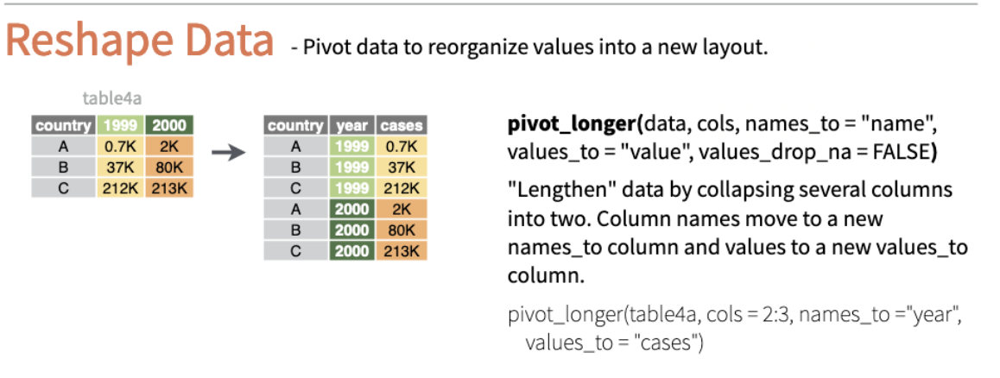
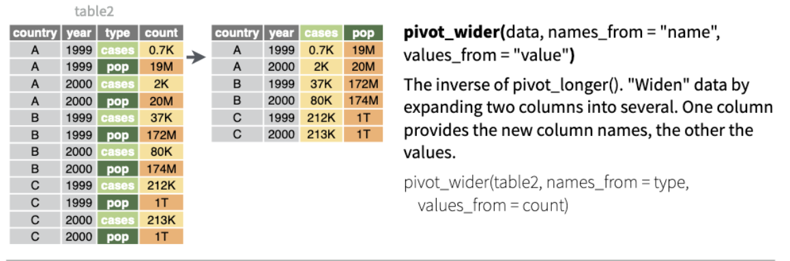

```{r chunksetup, include=FALSE} 
library(here)
library(tidyverse)
library(tibble)
```

## What is data wrangling 

> It is often said that 80% of data analysis is spent on the process of cleaning and preparing the data (Dasu and Johnson 2003). 

At its heart, data wrangling is the set of techniques to get data into a usable form for analysis and visualization. 

Data wrangling is a catchall for data importing, data cleaning, and data transformation to create some product with the finished data. 


## Tidy data 

All messy data is unhappy in its own way. To put some structure on data, we prefer that our data is *tidy*. In tidy data, every column is a variable, every row is an observation, and every cell is a single value (Wickham 2014). 

Tidy datasets provide a standardized way to link the physical appearance of the dataset with its meaning (Wickham 2014). Datasets are made of **rows** and **columns** that contain a collection of **values** 

## Challenge 1 

Here is a dataset inspired by an Economist/YouGov Poll about the importance of unemployment in the United States. 

```{r}
challenge_1 <- tibble(
  issue_importance = c("Very Important", "Somewhat Important",
                       "Not very Important", "Unimportant"),
  `18-29` = c(.59, .28, .08, .05),
  `30-44` = c(.66, .27, .06, .02),
  `45-64` = c(.69, .28, .03, .01),
  `65+` = c(.7, .27, .02, .01)
)

head(challenge_1)
```

Answer the following: 

1. How many observations are in the data set?

2. How many columns are in the data set?

3. Is every column a variable?

## Challenge 2

Consider the data below. Both data sets display information on heart rate observed in individuals across three different time periods. But the data are organized differently in each table. Which one of these do you think is the *tidy* format?

```{r}
wide <- data.frame(
  name = c("Wilbur", "Petunia", "Gregory"),
  time1 = c(67, 80, 64),
  time2 = c(56, 90, 50),
  time3 = c(70, 67, 101)
)
wide

long <- data.frame(
  name = c("Wilbur", "Petunia", "Gregory", "Wilbur", "Petunia", "Gregory", "Wilbur", "Petunia", "Gregory"),
  time = c(1, 1, 1, 2, 2, 2, 3, 3, 3),
  heartrate = c(67, 80, 64, 56, 90, 50, 70, 67, 10)
)
long
```

For the "wide" format, each row is often a site/subject/patient, and you have multiple observation variables containing the same type of data. These can be repeated observations over time or multiple variables (or a mix of both). In the above case, we had the same kind of data (heart rate) entered across three different columns, corresponding to three different time periods. The key here is that these underlying characteristics are shared by a discrete entity.

We often refer to these two opposite structures as "long" vs. "wide" formats. In the "long" format, you usually have 1 column for the observed variable(s), and the other columns are ID variables. We do this most often when the columns are not names of variables, but instead values of variables. Our next example provides the conceptual underpinnings of this approach. 

## A Representative Example of Tidy Data 

Let's make the data tidy.

```{r, echo = F}
challenge_1 %>% 
  pivot_longer(-issue_importance, 
               names_to = "age", 
               values_to = "percent_agreement")%>%
  head()

```

The format here is now tidy. Each column represents a single variable. The separate age columns have been combined into a single column. Each row represents a single cross-sectional observation. Finally, each cell represents a single value. 

There's some code here that might be brand new to you. We will cover everything in this code block, but to get familiar with the structure, note that we needed to make a dataset that was "wide" (many columns) into a dataset that was "long" (many rows). We did this by "pivoting" the non-variable columns into a two-column key-value pair. While sometimes we may have more than two columns, the general pattern is typical and language agnostic. `pivot_longer()` increases the number of rows and decreases the number of columns. 

## The Tidyverse 

The tidyverse is a core set of packages that most R programmers use daily for everyday data science tasks. We can load this set of packages all at once with: 

```{r}
library(tidyverse)
```

Alternatively, we can load individual packages from the tidyverse. For example, we can load the `dplyr` package. 

```{r}
library(dplyr)
```


## The Grammar of Data Wrangling

The dplyr package provides many very useful functions for manipulating data frames. These functions will save you time by reducing repetition. As a bonus, you might even find the `dplyr` grammar easier to read.

In this workshop, we will cover 6 of the most commonly used functions and use pipes (`%>%`) to combine them.

1. `filter()`: pick out observations based on their values
2. `select()`: pick certain columns by name
3. `group_by()`: group observations based on a variable
4. `arrange()`: reorder observations based on a variable
5. `summarize()`: summarize observations based on some function 
6. `mutate()`: create new variables with function of existing variables

Each of these verbs works similarly. The first argument is always a data frame object. The additional arguments describe what to do with the data frame using unquoted variable names. The result is a new data frame. 

## An Example Workflow 

Before diving into each function, let's give an example of a data wrangling workflow that starts from reading in a dataset and then makes a dataset suitable for a descriptive analysis. This example contains an example of every verb we will talk about in this workshop.  

Suppose we have a dataset of individuals' occupations from different US states. In the data folder for this workshop repository, a dataset called "jobs" matches this description. We can read it in with `read_csv(),` which is available from the tidyverse. `read_csv` works exactly like `read.csv` but is much quicker. 

The `here` function is a way to create file paths relative to the top-level directory. 

For a descriptive analysis, we'd like to know the average life expectancy for individuals who are and are not in agriculture for states within each state on the West Coast. To accomplish this task, we will need to:

- filter our list of states
- group by each state, create a variable denoting whether the individual works in agriculture or not, and 
- summarize the average age of individuals who do and do not work in agriculture. 

Finally, we'd like to arrange the states in reverse alphabetical order. 

What follows is an example of the workflow just described in the spirit of [teaching the whole game](https://www.gse.harvard.edu/news/uk/09/01/education-bat-seven-principles-educators)

```{r}
## Data import 
jobs <- read_csv(here("data/jobs.csv"))
```

Let's look at the first six rows of this dataset 

```{r}
head(jobs)
```

Within the tidyverse, there's also a nice function in the tidyverse called `glimpse()` which makes it possible to see every column in the data frame. 

```{r}
glimpse(jobs)
```

```{r}
## Workflow 

  ## Start with the jobs data frame 
jobs %>% 
  ## Select and keep only three columns of interest 
  select(State, Occupation, Age)%>%
  ## Subset down to just the observations that match 4 states
  filter(State %in% c("Alaska","California", "Oregon", "Washington"))%>%
  ## create a dummy variable about whether an occupation is in agriculture
  mutate(in_ag = if_else(Occupation == "Farmer", "Yes", "No"))%>%
  ## group the observations by state and then the created dummy 
  group_by(State, in_ag)%>%
  ## create a new data frame with a summary of the age variable 
  ## for each grouping 
  summarise(average_lifeExp = mean(Age))%>%
  ## Sort the rows in reverse order by state
  arrange(desc(State))

## We can also save the output of our workflow to a new data frame object
wc_lifeExp <- jobs %>% 
  select(State, Occupation, Age)%>%
  filter(State %in% c("Alaska","California", "Oregon", "Washington"))%>%
  mutate(in_ag = if_else(Occupation == "Farmer", "Yes", "No"))%>%
  group_by(State, in_ag)%>%
  summarise(average_lifeExp = mean(Age))%>%
  arrange(desc(State))
```

The way to think of the pipe, the symbol at the end of each of these lines that is %>%, is that it takes what is on the left side and makes it the first argument of the right side. 

The tidyverse is built around pipes because the first argument of every function in the tidyverse is a data frame, which means that the tidyverse all follows the same structure. When doing data tasks, having the same structure turns out to be very useful because it is easy to reason about what a function will do and what it needs. 

## Pipes 

A pipe operator `%>%` or `|>` is a method of chaining together functions. A pipe takes what is on the left-hand side of the pipe and makes it the first argument of the function on the right-hand side by default. 

```{r, eval = F}
## Pseudo code 
x %>% f(y) 

## is equivalent to 
f(x, y)

## where f() is a function 

## Example with the jobs data set 
jobs %>% 
  filter(State == "California")

## is equivalent to 
filter(jobs, State == "California")
```


As mentioned, the advantage of the tidyverse is that every function presumes that the first argument is a tidy data object. It is possible to put the left-hand side result as a different argument for the function on the right-hand side by explicitly specifying it. However, a well-written workflow tends to obviate the need to do so. 

## London Animal Rescue Dataset 

To show the benefits of the `dplyr` verbs, we will start by working with a dataset of animal rescue incidents by the London Fire Brigade from 2009-2021. The data provides information on all incidents and information on the location, date and time, number of fire trucks, and cost of the rescue. 

```{r}
animals <- read_csv(here("data/animalRescue.csv"))
glimpse(animals)
```


## filter()

Suppose we are interested in looking at animal rescues from 2018-2020. `filter()` allows us to subset observations based on their value. 

Since we are introducing a verb explicitly for the first time, we will show the verb with and without pipes. The API is the same for every verb. 

```{r}
## Get all observations from the Year 2015 
filter(animals, Year == 2015)

## Get all observations from 2018-2020 
filter(animals, Year >= 2018 & Year <=2020)

```

The first argument is the name of the data frame we want to use, in this case, "animals." The arguments after are the expressions that filter the data frame. 

Here is the same code with a pipe and a neat shortcut 

```{r}
animals %>% 
  filter(Year == 2015)

animals %>% 
  filter(Year >= 2018 & Year <= 2020)

## which is the same as 
animals %>% 
  filter(between(Year, 2018, 2020))
```

As with the examples we have seen before, we take the animals data frame and then pass it via the pipe to the filter argument. Because the pipe puts the data frame as the first argument for every tidyverse function, we only have to specify the subsequent arguments. `between()` is a `dplyr` function that is a shortcut for x >= left & x <= right where x is our variable of interest.

Note that `between()` will not work if you want to exclude an endpoint.

 
 You can extend filter() with logical conditions:
 
| Symbol                 | Meaning                  |
|------------------------|--------------------------|
| <                      | less than                |
| >                      | greater than             |
| ==                     | equal to                 |
| <=                     | less than or equal to    |
| >=                     | greater than or equal to |
| !=                     | not equal to             |
| %in%                   | group membership         |
|is.na                   | is NA                    |
| !is.na                 | is not NA                |
|&, \|, !, xor, any, all | Boolean operators        |
 
## Challenge 3

Create a new data frame object called `cats_and_dogs` that filters the `animals` data frame for all observations for which the animal type is a cat or a dog. Use the pipe operator to chain the functions together. 

```{r, include=F}
#YOUR CODE HERE

```

## Multiple Filters at once 

Sometimes we want to filter multiple conditions at once. For example, we might be interested in all rescues of birds or horses after 2011. We use the `,` in our filter expression to accomplish this. 

```{r}
birds_and_horses <- animals %>% 
  filter(Type == "Bird" | Type == "Horse", Year > 2011)
glimpse(birds_and_horses)
```

We can put multiple `filter` functions in a row in a piped workflow, though it does not look as readable. 

```{r}
birds_and_horses2 <- animals %>% 
  filter(Type == "Bird"|Type == "Horse")%>%
  filter(Year > 2011)

## These two data frames are the same 
all.equal(birds_and_horses, birds_and_horses2)
```

For completeness, this also works

```{r}
birds_and_horses3 <- animals %>% 
  filter((Type == "Bird"|Type == "Horse") & Year > 2011)

all.equal(birds_and_horses, birds_and_horses3)

```

We see here the power of the `,` argument because it is making implicit how the parentheses should work without us accidentally making a mistake. For example 

```{r}
birds_and_horses4 <- animals %>% 
  filter(Type == "Bird"|Type == "Horse" & Year > 2011) 

## Will not be the same. 
all.equal(birds_and_horses, birds_and_horses4)

```

## select()

Now we have a data frame of just rescues of cats and dogs. Suppose we are only interested in a few variables of the data frame. We can use the `select()` function to keep only the variables we select. 


To be concrete, suppose we just want to see the Year, Type, and PropertyCategory variables.

```{r}
cats_and_dogs <- animals %>% 
  filter(Type == "Cat"|Type == "Dog")

cats_and_dogs_short <- cats_and_dogs %>% 
  select(Year, Type, PropertyCategory)
```

If we open up `cats_and_dogs_short`, we'll see that it only contains the Year, Type, and PropertyCategory columns. 

Both the `select()` and `filter()` functions subset the data frame. The difference is that `select()` extracts certain columns, while `filter` extracts certain rows. 

When using `select` and `filter` together, the order of operations is very important. If we used `select()` first, the `filter()` function can only filter on variables that we selected. 

We can also select observation variables using:
  - variable indices
  - variable names (without quotes)
  - `x:z` to select all variables between x and z
  - `-y` to *exclude* y
  - `starts_with(x, ignore.case = TRUE)`: all names that starts with `x`
  - `ends_with(x, ignore.case = TRUE)`: all names that ends with `x`
  - `contains(x, ignore.case = TRUE)`: all names that contain `x`

## Split-Apply-Combine

A common task you'll encounter when working with data is running calculations on different groups within the data. For instance, what if we wanted to calculate the total number of cat rescues for each borough?

The abstract problem we're encountering here is known as "split-apply-combine":


We want to *split* our data into groups (in this case boroughs), *apply* some calculations on that group (in this case count), and then *combine* the results together afterward. This pattern is common in data wrangling and a cornerstone of the dplyr approach. 

## group_by()

A `grouped_df` can be thought of as a `list` where each item in the `list` is a `data.frame` containing only the rows that correspond to the particular value `continent` (at least in the example above).


Let's demonstrate the benefits of `group_by` by answering the question, "What are total number of cat rescues for each borough?"

```{r}
borough_cat_rescues <- animals %>% 
  ## group all observations by Boroughs
  group_by(Borough)%>%
  ## get just the observations of cat rescues 
  filter(Type == "Cat")%>%
  ## new function! count the unique values of one or more variables
  count(Type)

head(borough_cat_rescues)
```

We pass `ungroup()` to our data to ungroup our dataset. 

```{r}
animals %>% 
  group_by(Borough)%>%
  filter(Type == "Cat")%>%
  count(Type)%>%
  ungroup()
```

## arrange()

We now have cat rescues by boroughs, but our quick glimpse has them in a strange order. To get the observations from smallest to largest, we can use `arrange()` and pass the variable name of interest. 

```{r}
borough_cat_rescues %>%
  arrange(n)

```

If we want to reverse the order, we need to wrap the variable name in `desc()` like so 

```{r}
borough_cat_rescues %>%
  arrange(desc(n))

```

## Challenge 4

Let's put the verbs we've learned so far into action all at once. Answer the question "What are the total number of dog rescues for each borough?" by making a data frame called `borough_dog_rescues` and arranging the rows by borough in alphabetical order. 

```{r}
## Your Code here 

```

## summarize()

`summarise()` or `summarize()` collapses a data frame to a single row. 

```{r}
animals %>% 
  summarise(avg_rescue_cost = mean(RescueCost, na.rm = T))

## Note that summarise can also be written with a z 
animals %>% 
  summarize(avg_rescue_cost = mean(RescueCost, na.rm = T))
```


`summarise()` becomes extremely useful when paired with `group_by()`. We just saw that our last block gave the average cost across our data set. By using the `group_by()` function, we split our original data frame into multiple pieces, which we then use to run functions (e.g. `mean()`) within `summarize()`. 


Suppose instead we are interested in the average cost of a rescue for each borough. 

```{r}
animals %>% 
  group_by(Borough)%>%
  summarise(avg_rescue_cost = mean(RescueCost, na.rm=T))%>%
  arrange(desc(avg_rescue_cost))
```

We are not limited to grouping by just one variable. We can group by multiple variables. Let's answer the question, "What's the average cost by borough year?" 

```{r}
animals %>% 
  group_by(Borough, Year)%>%
  summarise(avg_rescue_cost = mean(RescueCost, na.rm=T))%>%
  arrange(Borough)

```

That is already quite powerful, but it gets even better! We are not limited to defining one new variable in `summarize()`. Suppose we want to know the average deviation within each borough year. 

```{r}
animals %>% 
  group_by(Borough, Year)%>%
  summarise(avg_rescue_cost = mean(RescueCost, na.rm=T),
            sd_rescue_cost = sd(RescueCost, na.rm = T))%>%
  arrange(Borough)
```

You will receive a message that says "`summarise()` has grouped output by 'Borough'. You can override using the `.groups` argument." This is an experimental feature in `dplyr` and does not change the results of our computation at all. The computation that is identical but leads to R not sending that message is the following:

```{r}
animals %>% 
  group_by(Borough, Year)%>%
  summarise(avg_rescue_cost = mean(RescueCost, na.rm=T),
            sd_rescue_cost = sd(RescueCost, na.rm = T),
            .groups = "drop_last")%>%
  arrange(Borough)

```

## Challenge 5

Create a data frame that considers the average rescue cost, median rescue cost, and standard deviation for bird rescues for each property category year. Save the result of your workflow into a data frame object called `bird_stats`


```{r, include=F}
#YOUR CODE HERE

```

## mutate()

`mutate()` creates new variables to the same data frame that you pass into it. 

To demonstrate `mutate()`, load the `gapminder-FiveYearData.csv` into RStudio as a data frame object called gapminder

```{r}
gapminder <- read_csv(here("data/gapminder-FiveYearData.csv"))
glimpse(gapminder)
```

The gapminder dataset has six variables and is in tidy form. One of those variables is lifeExp. Imagine we are interested in comparing the difference between a country's life expectancy and the average continent-year-wide life expectancy by year. Such a query requires us to make two new variables. The first variable is the mean continent-year life expectancy. The second variable is the difference between life expectancy for a country and the continent's life expectancy for every year. 

`mutate()` easily handles both cases. We can also use `mutate()` to create new variables before (or even after) summarizing information.

```{r}
gapminder_xtra_vars <- gapminder %>% 
  group_by(year, continent)%>%
  mutate(continent_lifeExp = mean(lifeExp, na.rm = T),
         diff_lifeExp = lifeExp - continent_lifeExp)
```

Note that `mutate()` does not require a `group_by()`. We can simply add a new column, either as a function of existing columns or through a new computation. Here's an example of doing both. 

```{r}
gap_mutate_no_group <- gapminder %>% 
  mutate(gdp_billion = (gdpPercap*pop)/10^9, 
         new_comp = 2+2)
```

A final useful function to know is the how-to count observations within a mutate. `dplyr` provides the handy `n()` function for this computation. Here's an example. 

```{r}
gap_count <- gapminder %>% 
  filter(year == 2007)%>%
  group_by(continent)%>%
  mutate(numCountries = n())%>%
  # distinct works like select() except it returns only rows 
  # that are unique
  distinct(continent, numCountries)%>%
  arrange(desc(numCountries))

```

## Challenge 6

Add a column to the gapminder dataset that contains the continent's total population of each observation in a given year. For example, if the first observation was Afghanistan in 1952, the new column would contain the population of Asia in 1952. 

```{r, include=F}
#YOUR CODE HERE
```

## Challenge 7

Use dplyr to: (a) add a column called `gdpPercap_diff` that contains the difference between the observation's `gdpPercap` and the mean `gdpPercap` of the continent in that year, (b) arrange the data frame by the column you just created, in descending order (so that the relatively richest country/years are listed first)

```{r, include=F}
#YOUR CODE HERE
```

## pivot_longer()

Until now, we have been using the nicely formatted, original gapminder dataset. Now, let's start with the wide-format version of the gapminder dataset.

```{r}
gap_wide <- read_csv(here("data/gapminder_wide.csv"))
head(gap_wide)
```

The first step towards getting our nice, *tidy* data format is to convert from the wide to the long format. 

The function `pivot_longer()` will "gather" the observation variables into a single variable. 


This image comes from the [RStudio Cheatsheets](https://github.com/rstudio/cheatsheets).

```{r}
gap_long <- gap_wide %>% 
  pivot_longer(
    cols = 3:38, 
    names_to = "obstype_year",
    values_to = "obs_values"
  )
head(gap_long)
```


Notice that we put three arguments into the `pivot_longer` function: 

1. We want to gather the column indices of the old observation variables (`3:38`, signaling columns 3 through 38) into one variable. Notice that we want to keep columns 1 and 2, as these are considered "ID" variables. 

An alternative way to do indices is to type in the column names of interest explicitly. Here is an example where we exclude the first two columns. 

```{r}
make_Long <- gap_wide %>% 
  pivot_longer(
    cols = c(-continent, -country), 
    names_to = "obstype_year",
    values_to = "obs_values"
  )
head(make_Long)
```

2. the name of the new column for the new ID variable (`obstype_year`), 

3. the name for the new amalgamated observation variable (`obs_value`) 

Alternatively, we can use the column structure in the `gap_wide` data frame to do the same thing with the `starts_with` function.

```{r}
# with the starts_with() function
gap_long <- gap_wide %>%
    pivot_longer(
    cols = c(starts_with('gdpPercap'), 
             starts_with('lifeExp'),
             starts_with('pop')),
    names_to = "obstype_year",
    values_to = "obs_values"
  )
head(gap_long)
```

However you choose to do it, notice that the output collapses all of the measure variables into two columns: one containing the new ID variable, the other containing the observation value for that row. 

## separate()

You'll notice that in our long dataset, `obstype_year` actually contains two pieces of information, the observation type (`pop`, `lifeExp`, or `gdpPercap`) and the `year`.

We can use the `separate()` function to split the character strings into multiple variables:

```{r}
gap_long_sep <- gap_long %>% 
  separate(obstype_year, into = c('obs_type','year'), sep = "_") %>% 
  mutate(year = as.integer(year))
head(gap_long_sep)
```

## pivot_wider()

The opposite of `pivot_longer` is `pivot_wider`. It spreads our observation variables back out to make a wider table. We can use this function to spread our `gap_long()` to the original format.


This image comes from the [RStudio Cheatsheets](https://github.com/rstudio/cheatsheets).

```{r}
gap_original <- gap_long_sep %>% 
  pivot_wider(
    names_from = obs_type, 
    values_from = obs_values)
head(gap_original)
```

## Challenge 8

1. We have provided the code below to answer Challenge 7. Ungroup the results, then subset them to select only the `country`, `year`, and `gdpPercap_diff` columns. Put it in a wide format so that countries are rows and years are columns.

2. Now, turn the data frame above back into the long format with three columns: `country`, `year`, and `gdpPercap_diff`.

```{r, include=F}
## Starter code 
gapminder_gdpPercap_diff <- gapminder %>%  
  group_by(continent, year) %>% 
   mutate(mean_continent_gdp = mean(gdpPercap),
          gdpPercap_diff = gdpPercap - mean_continent_gdp)
```


```{r, include=F}
#YOUR CODE HERE

```
